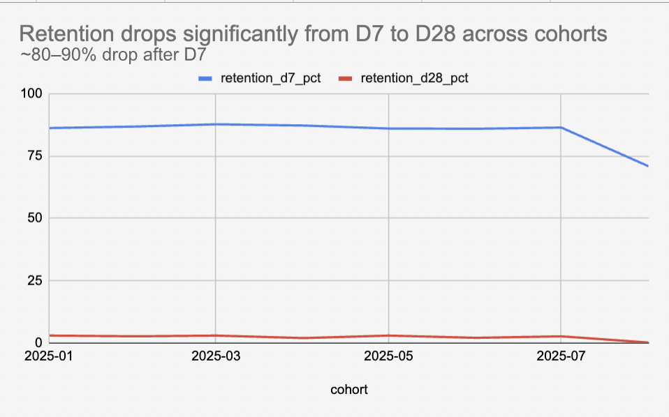
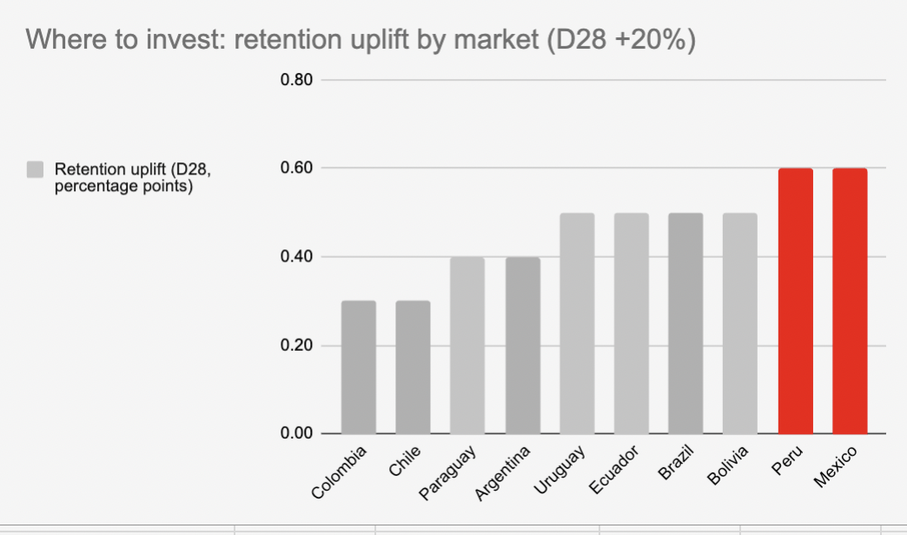
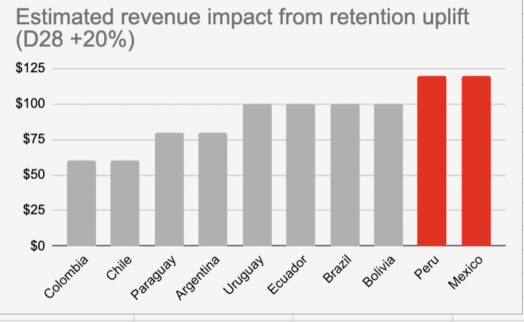

<h1 align="center">🛒 E-commerce Funnel & Retention Analysis</h1>

  <i>Data Analysis Project • SQL / Excel • Product & Growth Insights</i>

<h2>🧠 Overview</h2>

This project analyzes user behavior across an e-commerce funnel to identify drop-off points and retention patterns.

Using MercadoLibre data, the analysis focuses on understanding conversion efficiency, user engagement, and opportunities to improve customer retention.

<h2>📊 Visual Insights</h2>

  

  <i>Retention drops significantly after D7 across cohorts (~80–90% decline by D28)</i>

 

  

  <i>Markets like Mexico and Peru show the highest retention uplift potential</i>

 

  

  <i>Retention improvements can drive significant revenue impact across key markets</i>

<h2>🔍 What I Did</h2>

<ul>
  <li>Structured funnel analysis using event-based data</li>
  <li>Calculated conversion rates across key stages</li>
  <li>Identified critical drop-off points</li>
  <li>Analyzed retention trends across cohorts</li>
</ul>

<h2>📈 Key Findings</h2>

<ul>
  <li><b>Retention drops sharply after Day 7 (~80–90% by Day 28)</b></li>
  <li>Early user engagement is the main driver of long-term retention</li>
  <li>Markets like Mexico and Peru present the highest growth opportunity</li>
  <li>Improving retention has a direct and measurable impact on revenue</li>
</ul>

<h2>📌 Business Impact</h2>

<ul>
  <li>Optimize early user experience to improve Day 7 retention</li>
  <li>Focus growth strategies on high-impact markets (Mexico, Peru)</li>
  <li>Use retention as a core KPI for revenue growth</li>
</ul>

<h2>🛠 Tech Stack</h2>

SQL • Excel • Data Analysis

<h2>📁 Project Files</h2>

<code>funnel_retention_analysis.xlsx</code>

<h2>🎯 Final Insight</h2>

<b>Small improvements in early retention stages can generate significant revenue impact.</b>  
Understanding user behavior is key to scaling e-commerce performance.

  <i>Focused on product analytics, user behavior, and data-driven growth.</i>

